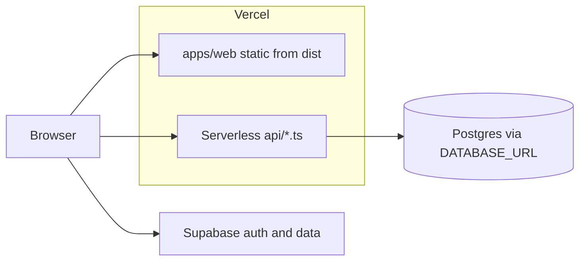

# Deploy NextPlay on Vercel (step by step)

## Prerequisites

- Code is pushed to a Git host Vercel supports (e.g. GitHub).
- You have a [Vercel](https://vercel.com) account and the repo is available to import.
- Local project uses **pnpm** at the **repository root** (`pnpm-workspace.yaml`); keep **Root Directory** in Vercel as the **repo root** (default), not `apps/web`, so `pnpm install` and workspace filters work.

## 1. Import the project

1. In Vercel: **Add New… → Project**.
2. **Import** your Git repository.
3. Leave **Root Directory** empty (or `.`) so it matches the monorepo root.

## 2. Framework and build (usually auto-detected)

[`vercel.json`](vercel.json) already defines:

- **Framework preset:** `"framework": null` (**Other**). The Vite preset can deploy the SPA from `outputDirectory` but **omit** repo-root [`api/`](api/) serverless routes on some deployments, which surfaces as platform **`404 NOT_FOUND`** (`text/plain`, `x-vercel-error: NOT_FOUND`) for every `/api/*` URL. Using **Other** keeps your explicit `buildCommand` / `outputDirectory` and still picks up `api/**/*.ts`.
- **Install:** `pnpm install --frozen-lockfile`
- **Build:** `pnpm prisma:vercel-build && pnpm --filter @nextplay/shared build && pnpm --filter @nextplay/web build` (Vercel runs **`prisma generate` only** — not `migrate deploy`; see below.)
- **Output:** `apps/web/dist`
- **SPA routing:** [`vercel.json`](vercel.json) uses `rewrites` so only non-`/api` paths fall back to `index.html`. If `/api/*` were sent to the SPA, the app would show “Could not load boards” because the client would receive HTML instead of JSON.

In the Vercel UI, **Framework Preset** may show **Other** once `vercel.json` is applied. If the dashboard shows different commands, prefer what is in `vercel.json` after import.

**Sanity check after deploy:** open `https://<deployment>/api/ping`. You should see `{"ok":true}` (JSON). If you still get `NOT_FOUND`, the `api/` folder is not part of the deployment (e.g. wrong **Root Directory** — must be repo root, not `apps/web`).

### If you can’t set `pnpm install --frozen-lockfile` in the dashboard

1. **Project → Settings → General → Build & Development Settings** (or **Build and Output Settings** on import): enable **Override** for **Install Command**, then use either:
   - `pnpm install --frozen-lockfile`, or  
   - `pnpm install` only — the repo root [`.npmrc`](.npmrc) has `frozen-lockfile=true`, but that is **ignored** if the command still includes `--no-frozen-lockfile` (remove that flag).
2. Commit and push root [`vercel.json`](vercel.json); with **no** conflicting install override in the UI, Vercel will use `installCommand` from the file.
3. If install fails with a lockfile error, run `pnpm install` locally, commit `pnpm-lock.yaml`, and redeploy.

## 3. Node.js version

Set **Node.js** to **20.x** (matches [`package.json`](package.json) `engines.node`: `"20.x"`):

**Project → Settings → General → Node.js Version → 20.x**

## 4. Environment variables

Go to **Project → Settings → Environment Variables** and add each variable from [`.env.example`](.env.example).

Enable the same keys for **Preview** as for **Production** if you use preview URLs (`*.vercel.app`). Preview builds only receive variables scoped to Preview; missing `DATABASE_URL` / `SUPABASE_JWT_SECRET` there breaks `/api` on preview deploys.

| Variable | Purpose |
| -------- | ------- |
| `DATABASE_URL` | Prisma + `/api` runtime. On Vercel, prefer Supabase **pooler** `…:6543/...?pgbouncer=true`. For local `prisma db push`, if you see pooler-related errors, use the **direct** Postgres URI (`db.<ref>.supabase.co:5432`) in your root `.env` instead. |
| `SUPABASE_JWT_SECRET` | Verifies Supabase JWTs in serverless API ([`api/_lib/auth.ts`](api/_lib/auth.ts)). From Supabase dashboard → **Settings → API → JWT Secret**. |
| `VITE_SUPABASE_URL` | Public Supabase project URL for the browser. |
| `VITE_SUPABASE_ANON_KEY` | Public **anon** key only (never the service role key). |
| `VITE_API_URL` | **Set to `/api`** (same for Production, Preview, and Development). The browser then always calls the API on **the same host** as the page—Preview deploys hit the Preview API, not Production. Do not hardcode `https://…vercel.app/api` unless you intentionally pin a fixed backend. |

`prisma generate` during build does not require a live database; `DATABASE_URL` is still required at **runtime** for API routes that use Prisma.

### Prisma Migrate on Vercel (P3005)

If **`prisma migrate deploy`** runs during CI/Vercel on a **non-empty** Supabase database that was never tracked by Prisma Migrate, the build fails with **P3005** (*database schema is not empty*). The Vercel build therefore uses **`pnpm prisma:vercel-build`** = `prisma generate` only.

**Apply schema changes yourself** (one-off from your machine with `DATABASE_URL` in a root `.env` or your shell):

- Quick align: **`pnpm install`** then **`pnpm prisma:db-push`** (uses the repo’s **Prisma 5.x** from `node_modules`).
- **Do not run bare `npx prisma db push`** without a version: npm will install **Prisma 7+**, which rejects `url` / `directUrl` in `schema.prisma` (error **P1012**). If you must use npx, pin it: `npx prisma@5.22.0 db push`.
- Or: `pnpm prisma:migrate:deploy` after you [baseline](https://www.prisma.io/docs/guides/migrate/production-troubleshooting#baseline-an-existing-database-production-db-already-has-a-schema) the DB (e.g. mark existing migrations as applied with `prisma migrate resolve` when tables already match).

After the DB is baselined and you want migrations on every deploy, you can switch `vercel.json` **buildCommand** to use `pnpm prisma:vercel-build:with-migrate` instead (and ensure build env has DB credentials).

## 5. Deploy

1. Click **Deploy** (first time) or push to your production branch (often `main`).
2. If **install** fails with a lockfile error, fix the lockfile locally with `pnpm install` and commit `pnpm-lock.yaml`, then redeploy.
3. After a successful deploy, open the **production URL** and confirm the app loads and `/api` health or a simple authenticated flow works if you use it.

## 6. Optional checks

- **Custom domain:** **Project → Settings → Domains**.
- **Supabase:** Ensure redirect URLs / allowed origins include your Vercel URL if you use auth redirects.
- **Build inputs:** If the build fails or misses files, ensure nothing required for `prisma` or `packages/shared` is accidentally gitignored on the branch Vercel builds.

## 7. Troubleshooting: board loads but `/api/boards/…` returns 404

1. **Platform vs app 404:** If the response is **`text/plain`** with **`x-vercel-error: NOT_FOUND`**, Vercel did not run your function at all (wrong deploy layout / preset). If the response is **`application/json`** with `{"error":"not found"}`, the handler ran but denied or missed the board.

2. **`GET /api/ping`:** Should return `{"ok":true}`. If that is also `NOT_FOUND`, fix **Root Directory** (must be repo root, not `apps/web`) and confirm [`vercel.json`](vercel.json) uses `"framework": null` so `api/` is included. In **Deployments → [deployment] → Functions**, you should see entries like `api/ping`, `api/[...path]`, `api/boards`.

3. **Request URL in the browser:** Open DevTools → **Network** → **Request URL** must be `https://<your-host>/api/boards/<uuid>/…`. If it is `https://<your-host>/boards/…` (missing `/api`), fix **`VITE_API_URL`** (include `/api`, or leave unset) and redeploy.

4. **JSON `{"error":"not found"}` from the API:** Board missing in the DB for `DATABASE_URL`, or your user is not owner/member of that board.

## Architecture (what gets deployed)



This guide matches the current repo configuration; no extra config files are required beyond [`vercel.json`](vercel.json) and your Vercel project settings.

## Misleading “monorepo” snippets (avoid)

Some posts suggest putting API code under `apps/web/api` and using `vercel.json` like:

```json
"rewrites": [{ "source": "/api/(.*)", "destination": "/apps/web/api/$1" }]
```

**That does not apply here and is not valid Vercel routing in general:**

1. **`destination` is a URL path**, not a filesystem folder. There is no deployed route at `/apps/web/api/...` unless you have explicitly built the [Build Output API](https://vercel.com/docs/build-output-api/v3) layout yourself. A rewrite cannot “point at” a TypeScript file on disk.

2. **In this repo, serverless handlers live in the repository-root [`api/`](api/) directory** (sibling of `apps/web`), not under `apps/web/api`. Prisma and dependencies are wired from the **monorepo root**; moving handlers into `apps/web` only helps if **Project → Root Directory** is set to `apps/web`—but then you must also fix install/build so pnpm workspaces and `prisma generate` still run from the repo root (or duplicate tooling). The supported setup here is **Root Directory = repo root** + root **`api/`**.

3. **Dynamic segments like `/api/boards/:id` do not require a separate `[id].ts` per route.** [`api/[...path].ts`](api/[...path].ts) is a **catch-all** that handles `/api/boards`, `/api/boards/<uuid>`, `/api/boards/<uuid>/labels`, etc. (see [`api/_lib/resolveApiPathname.ts`](api/_lib/resolveApiPathname.ts) for path resolution).

If you still see **`x-vercel-error: NOT_FOUND`** with **`text/plain`**, Vercel is not attaching any function to that URL (wrong **Root Directory**, or static output-only deploy). Use **`GET /api/ping`** and the deployment **Functions** list to confirm functions are present; do not use rewrites to invented `/apps/web/api/...` paths.
