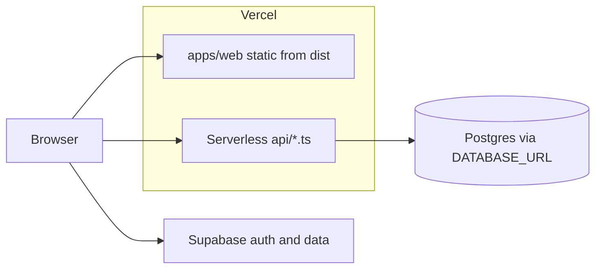

# Deploy NextPlay on Vercel (step by step)

## Prerequisites

- Code is pushed to a Git host Vercel supports (e.g. GitHub).
- You have a [Vercel](https://vercel.com) account and the repo is available to import.
- Local project uses **pnpm** at the **repository root** (`pnpm-workspace.yaml`); keep **Root Directory** in Vercel as the **repo root** (default), not `apps/web`, so `pnpm install` and workspace filters work.

## 1. Import the project

1. In Vercel: **Add New… → Project**.
2. **Import** your Git repository.
3. Leave **Root Directory** empty (or `.`) so it matches the monorepo root.

## 2. Framework and build (usually auto-detected)

[`vercel.json`](vercel.json) already defines:

- **Install:** `pnpm install --frozen-lockfile`
- **Build:** `pnpm prisma:generate && pnpm --filter @nextplay/shared build && pnpm --filter @nextplay/web build`
- **Output:** `apps/web/dist`
- **SPA routing:** [`vercel.json`](vercel.json) uses `rewrites` so only non-`/api` paths fall back to `index.html`. If `/api/*` were sent to the SPA, the app would show “Could not load boards” because the client would receive HTML instead of JSON.

In the Vercel UI, confirm **Framework Preset** is **Vite** (or “Other” with the above commands if you override). If the dashboard shows different commands, prefer what is in `vercel.json` after import.

### If you can’t set `pnpm install --frozen-lockfile` in the dashboard

1. **Project → Settings → General → Build & Development Settings** (or **Build and Output Settings** on import): enable **Override** for **Install Command**, then use either:
   - `pnpm install --frozen-lockfile`, or  
   - `pnpm install` only — the repo root [`.npmrc`](.npmrc) has `frozen-lockfile=true`, but that is **ignored** if the command still includes `--no-frozen-lockfile` (remove that flag).
2. Commit and push root [`vercel.json`](vercel.json); with **no** conflicting install override in the UI, Vercel will use `installCommand` from the file.
3. If install fails with a lockfile error, run `pnpm install` locally, commit `pnpm-lock.yaml`, and redeploy.

## 3. Node.js version

Set **Node.js** to **20.x** (matches [`package.json`](package.json) `engines.node`: `"20.x"`):

**Project → Settings → General → Node.js Version → 20.x**

## 4. Environment variables

Go to **Project → Settings → Environment Variables** and add each variable from [`.env.example`](.env.example).

Enable the same keys for **Preview** as for **Production** if you use preview URLs (`*.vercel.app`). Preview builds only receive variables scoped to Preview; missing `DATABASE_URL` / `SUPABASE_JWT_SECRET` there breaks `/api` on preview deploys.

| Variable | Purpose |
| -------- | ------- |
| `DATABASE_URL` | Prisma + `/api` runtime (e.g. Supabase **pooler** connection string). |
| `DIRECT_URL` | Optional; direct Postgres URL for local `prisma migrate` (often omitted on Vercel if you only run migrations locally). |
| `SUPABASE_JWT_SECRET` | Verifies Supabase JWTs in serverless API ([`api/_lib/auth.ts`](api/_lib/auth.ts)). From Supabase dashboard → **Settings → API → JWT Secret**. |
| `VITE_SUPABASE_URL` | Public Supabase project URL for the browser. |
| `VITE_SUPABASE_ANON_KEY` | Public **anon** key only (never the service role key). |
| `VITE_API_URL` | Browser base URL for your API, e.g. `https://<your-project>.vercel.app/api` (avoid trailing-slash mismatches with your client code). |

`prisma generate` during build does not require a live database; `DATABASE_URL` is still required at **runtime** for API routes that use Prisma.

## 5. Deploy

1. Click **Deploy** (first time) or push to your production branch (often `main`).
2. If **install** fails with a lockfile error, fix the lockfile locally with `pnpm install` and commit `pnpm-lock.yaml`, then redeploy.
3. After a successful deploy, open the **production URL** and confirm the app loads and `/api` health or a simple authenticated flow works if you use it.

## 6. Optional checks

- **Custom domain:** **Project → Settings → Domains**.
- **Supabase:** Ensure redirect URLs / allowed origins include your Vercel URL if you use auth redirects.
- **Build inputs:** If the build fails or misses files, ensure nothing required for `prisma` or `packages/shared` is accidentally gitignored on the branch Vercel builds.

## Architecture (what gets deployed)

This guide matches the current repo configuration; no extra config files are required beyond [`vercel.json`](vercel.json) and your Vercel project settings.
